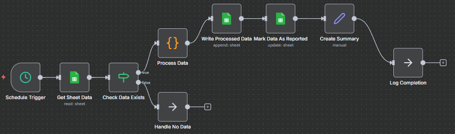
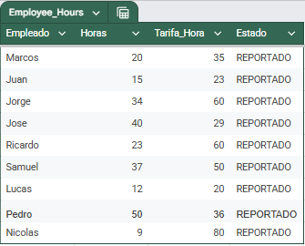
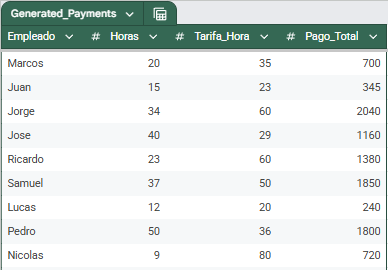

# 🛡️ Payment Reporting Automation with State Control (Generador de Reportes de Pago)

## 📌 Problem Statement

Manual tracking of processed payroll data led to recurrence of duplication errors and inefficiency in generating payment totals for bank reconciliation.

## ✨ Solution & Architecture

A robust, schedule-triggered workflow built to read new data, calculate payments, and guarantee **zero-duplication** via state tracking.

### Key Components:

1.  **Anti-Duplication Mechanism:** The initial data ingestion uses a filter on the `Estado` column (`Estado != 'REPORTADO'`) to ensure that only new records are processed.
2.  **ETL (Transformación):** The custom JavaScript node calculates individual payments (`Horas * Tarifa_Hora`) and performs the necessary data cleanup (removal of control fields).
3.  **Aggregation:** The JavaScript code calculates the **Total Batch Sum** and injects it as the final row in the output stream, providing immediate audit value.
4.  **Security/Audit Trail:** The final node (`Mark Data As Reported`) updates the status of successfully written rows, closing the data integrity loop.

## 🛠️ Technologies Used

* **Platform:** n8n (Self-Hosted)
* **APIs:** Google Sheets API
* **Core Languages:** JavaScript (for ETL/Aggregation logic)
* **Architecture:** Schedule-Driven (Cron)

## 🌐 Resumen para el Portafolio (Español)

Este proyecto demuestra la habilidad para construir soluciones robustas de automatización con control de integridad de datos. El sistema genera un reporte de pagos, calcula el total general del lote e implementa un mecanismo de **Control de Estado** para evitar la duplicación de pagos.

